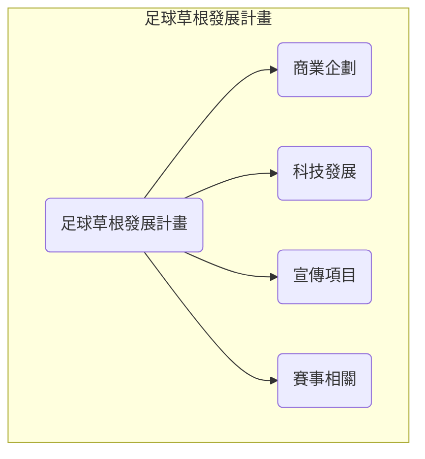

# 台灣足球草根發展計畫

## 足球草根發展計畫

### 目標
推廣足球運動，提供社區球隊與業餘球員良好的訓練及比賽環境，增加民眾對足球的興趣與參與度。

### 足球推廣協會
- 尋找足夠且有興趣與志願的人成立
- 串聯各個業界為主軸，進行商業發展的基礎建設
- 增加球迷計畫
- 增加球場計畫
- 結合商業、科技、媒體...等等一切領域進行計畫

### 商業企劃
- 多間公司贊助一支球隊
- 社區球隊贊助
- 贊助內容不限於金錢
- 與地方政府合作提供場地或其他贊助回饋社區
- 與各間企業社區合作設立場地並進行獲利計算或是社區球隊發展

### 科技發展
- AI 守門員與後衛的前鋒訓練系統
- 免費可公開的球隊與球員資訊
- 開發 AI 教練提供即時回饋協助球員改善技能
- 與運動器材公司合作開發智慧型球鞋或裝置協助球員改善步法或測量運動量

### 宣傳項目
- 針對球隊所在地區的介紹
- 針對球員的介紹
- 針對球員的精彩進門或防守或運球等等的介紹
- 針對賽事的介紹
- 運用社交媒體平台提供足球知識教學及賽事實況增加粉絲黏著度
- 與當地報紙電台合作提供足球專題報導宣揚足球運動精神

### 賽事相關
- 增加職業與簡易業餘賽事
- 業餘賽事的串連
- 業餘賽事的相關紀錄
- 招募足球愛好者志願者提供賽事支援及場地準備增加參與感與投入度
- 開發足球賽事網站、APP，提供賽事、球隊、球員、教練、裁判，場地等等細節資訊、直播及購票、宣傳贊助等等獲益功能
