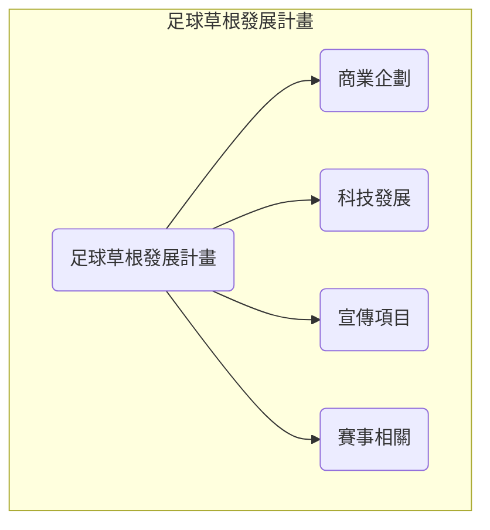

# 台灣足球草根發展計畫

## 足球草根發展計畫

### 目標
推廣足球運動，提供社區球隊與業餘球員良好的訓練及比賽環境，增加民眾對足球的興趣與參與度。

### 商業企劃
- 多間公司贊助一支球隊
- 社區球隊贊助
- 贊助內容不限於金錢
- 與地方政府合作提供場地或其他贊助回饋社區

### 科技發展
- AI 守門員與後衛的前鋒訓練系統
- 免費可公開的球隊與球員資訊
- 開發 AI 教練提供即時回饋協助球員改善技能
- 與運動器材公司合作開發智慧型球鞋或裝置協助球員改善步法或測量運動量

### 宣傳項目
- 針對球隊所在地區的介紹
- 針對球員的介紹
- 針對球員的精彩進門或防守或運球等等的介紹
- 針對賽事的介紹
- 運用社交媒體平台提供足球知識教學及賽事實況增加粉絲黏著度
- 與當地報紙電台合作提供足球專題報導宣揚足球運動精神

### 賽事相關
- 增加職業與簡易業餘賽事
- 業餘賽事的串連
- 業餘賽事的相關紀錄
- 招募足球愛好者志願者提供賽事支援及場地準備增加參與感與投入度
- 開發足球賽事 APP提供賽事資訊、直播及購票功能
